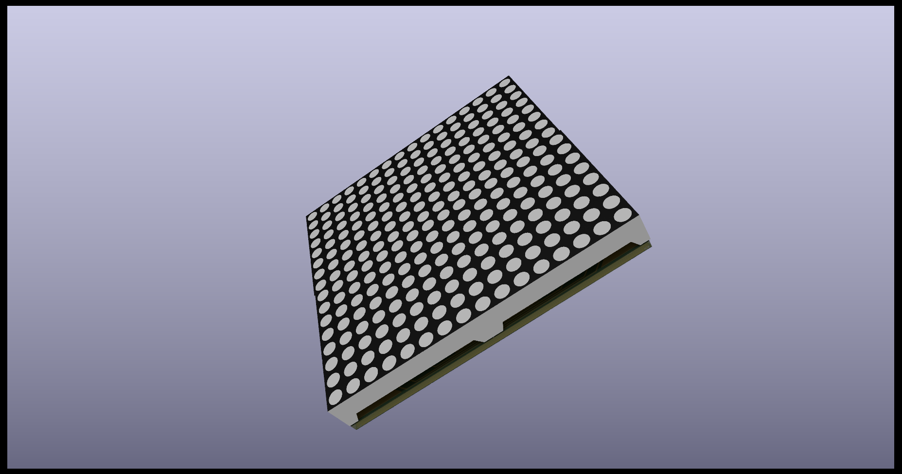
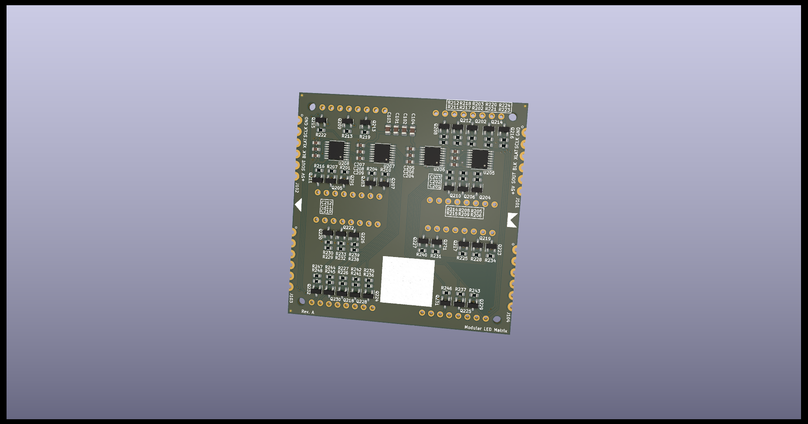
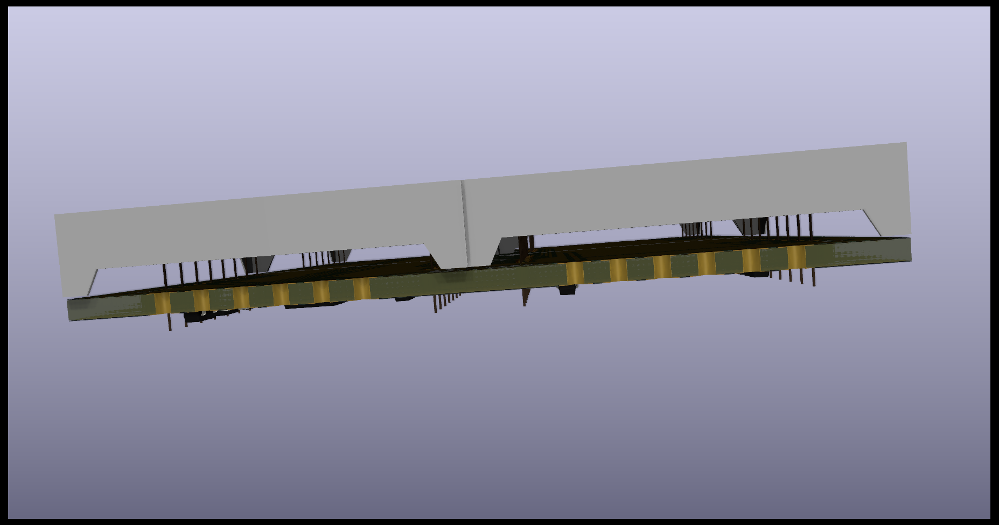
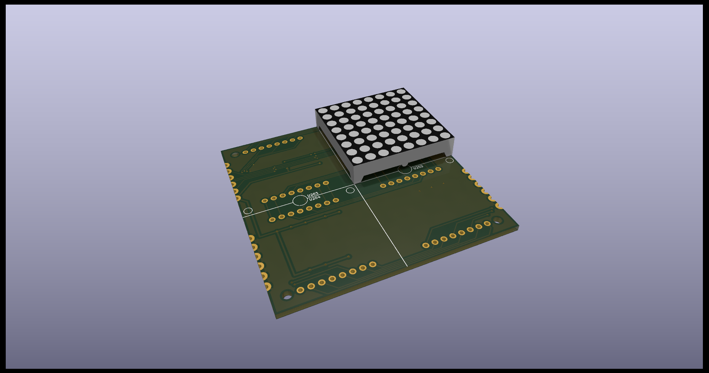

# Ledtrix, a fully modular 16x16 LED matrix

Tileable and low profile (less than 1cm) for display applications. Can be used in an artsy clock. Each single LED is source/sink driven by a pair of transistors.

The transistors are controlled by shift-registers. There are 4 daisy-chained shift-registers with each 8 outputs giving the required 16 rows and 16 columns drive signals.

## Tileable
The outline of the unit is the same as 4 LED modules in a 2x2 configuration. This makes it possible to seamlessly tile the Ledtrix along any of its four edges.

Signals travel through the board from the left to the right indicated by the arrow and socket. The boards are soldered together by edge connectors. Soldering all of these gives a sturdy unit.

### Mounting holes
There are four mount holes on the back. It is impossible to reach these holes once the LED modules have been soldered onto the PCB. They can be used with press fit mount stages.

## Driving the Ledtrix
This can be tricky as the focus has been to make the PCB routing as simple as possible. Some thought must be put into it.
## Pictures

